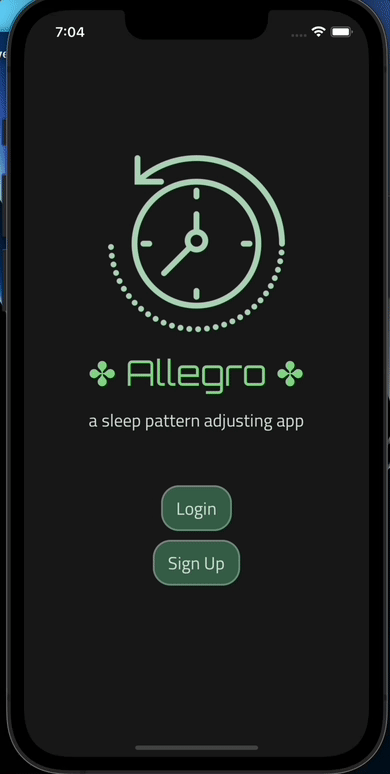

# Allegro


A React Native mobile app for adjusting the user's sleep pattern.

# Overview

-Users are able to set a starting alarm time and an earlier end alarm time.

-Everyday the alarm will trigger slightly earlier based on user-configured increments.

-For example: Patrick set the alarm to start at 8:00 and the end goal is 7:00. The increments are set to 2 mins per day.
Patrick will wake up at 8:00 the next day, and he will wake up 7:58 the day after that. The time will subtract until it reaches 7:00.

# GIFs



Login and signup.

---


Configuring the alarm and increments.

---


**Screenshot taken on my physical phone.** Alarm triggered at 9:00 to the user Sleepyhead. He has a start alarm at 9:00 and will reach 8:00 in 20 days. Tomorrow, the alarm will trigger at 8:57 since he configured the increment to be 3 minutes.

**To start the app**

```
// clone the repo
git clone git@github.com:MrMcPat/allegro.git
```

```
// Install expo cli if you do not haven't
npm i -g expo-cli
```

```
// start the frontend interface
npm start --prefix client
```
